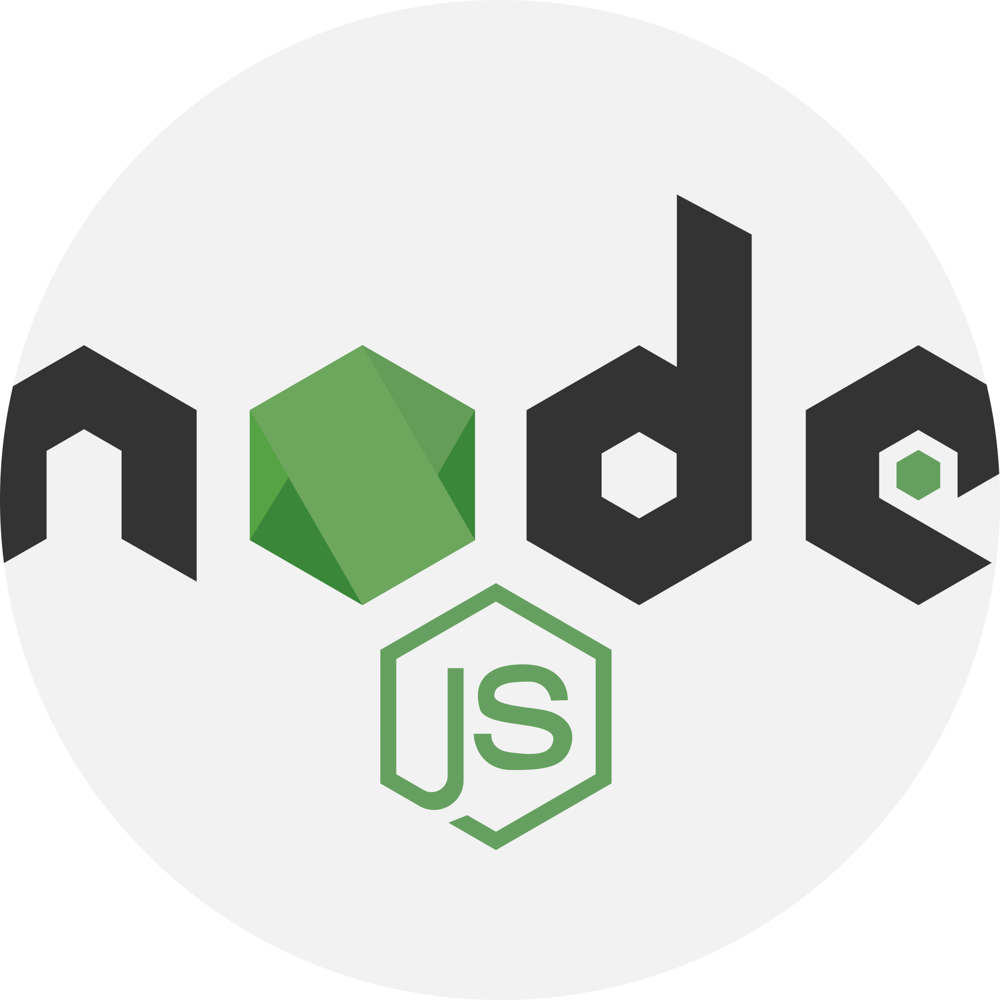

<h1 align="center">Hi 👋, I'm Supun</h1>
<h3 align="center">A passionate Software developer</h3>

  

  

  

- 🌱 I’m currently learning **ReactJS, NodeJS, ASP.NET MySQL, MongoDB**

- 🤝 I’m looking for help with **ReactJS, NodeJS**

- 📝 I regularly write articles on [ReactJS, NodeJS, Database](ReactJS, NodeJS, Database)

- 💬 Ask me about **Frontend and Backend Development, Databases**

- 📫 How to reach me **supundilshandelpagoda@gmail.com**

- ⚡ Fun fact **Talk to me and I bet you will be addicted to my company**

### Blogs posts
<!-- BLOG-POST-LIST:START -->
<!-- BLOG-POST-LIST:END -->

<h3 align="left">Connect with me:</h3>

<h2> Skills </h2>
<h3 align="left">Programming Languages:</h3>

    
    
    
    

<h3 align="left">Frontend Development:</h3>

    
    
    
    
    

<h3 align="left">Backend Development:</h3>

    
    

<h3 align="left">Artificial Intelligence /Machine Learning:</h3>

    
    
    
    
    
    

<h3 align="left">Database:</h3>

    
    

<h3 align="left">Tools:</h3>

    
    
    
    
    
    
    
    
    

<h3 align="left">IDE:</h3>

    
    
    
    

&nbsp;

