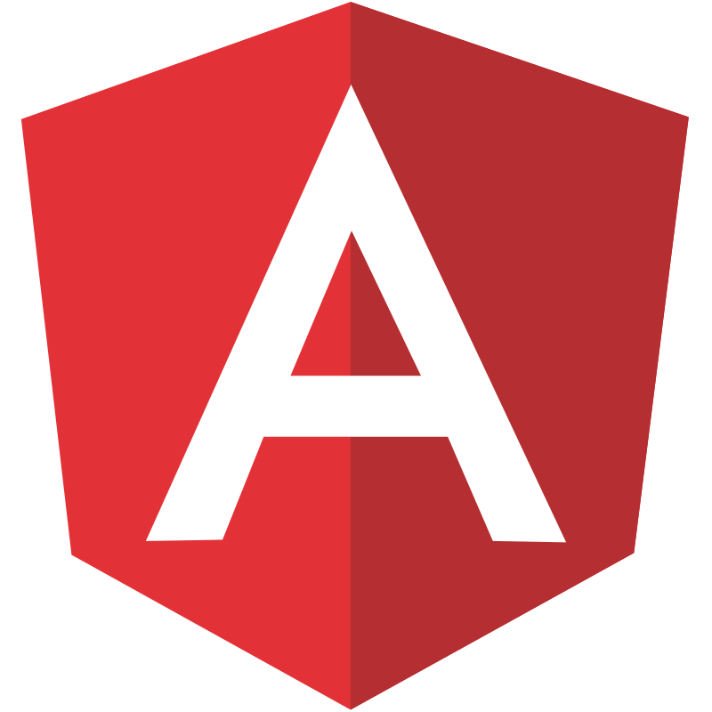

<h1 align="center">  Hi, I'm Supun Dilshan</h1>
<h3 align="center">A passionate Software developer</h3>

- 🌱 I am working with  **ReactJS, Angular, NodeJS, NestJS, Databases**

- 📝 I regularly write articles on [ReactJS, NodeJS, Database](ReactJS, NodeJS, Database)

- 💬 Ask me about **Full-Stack Development with Javascript**

- 📫 How to reach me **[Supun Delpagoda](https://www.linkedin.com/in/supun-delpagoda)**

- ⚡ Fun fact **Talk to me and I bet you will be addicted to my company**

<h2 align="left">Connect with me:</h2>

  
  
  
  
  
  

<h2> My Github Trophies </h2>

  

<!-- <h2> My Blogs posts </h2> -->

<!-- ### Blogs posts -->
<!-- BLOG-POST-LIST:START -->
<!-- BLOG-POST-LIST:END -->
<h2> Skills </h2>
<h3 align="left">Languages:</h3>

    
    
    
    
    

<h3 align="left">Frontend:</h3>

    
    
    
    
    
    

<h3 align="left">Backend:</h3>

    
    
    

<h3 align="left">Database:</h3>

    
    

<h3 align="left">Tools:</h3>

    
    
    
    
    
    

<h2> My GitHub stats</h2>

&nbsp;

